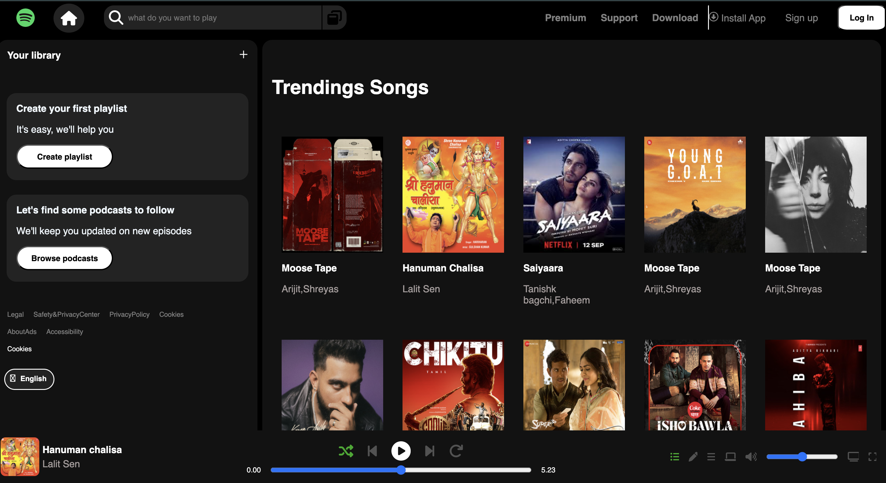
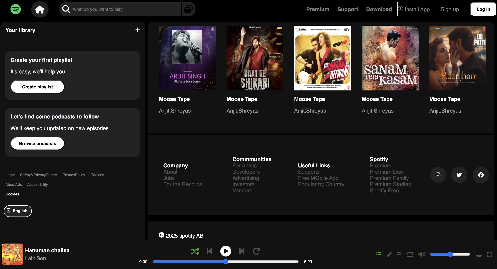

# Spotify Clone

A modern Spotify-inspired music player UI built using HTML, CSS, and JavaScript.

## 🚀 Features
- Spotify-style UI
- Trending songs section
- Sidebar navigation
- Music player controls
- Responsive dark theme

## 🧰 Technologies Used
- HTML
- CSS
- JavaScript

## ⚙️ How to Run
1. Download repository
2. Open index.html in browser

## 👨‍💻 Author
Pawan Agrahari

## 📸 Screenshots

### Home Page

### Music Player
